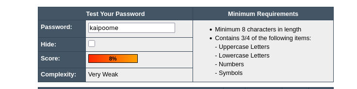
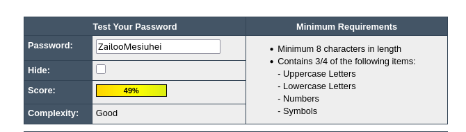
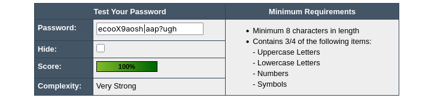

# Day 6: Password Generation 

## Generate Passwords 

I installed a command called ```pwgen``` from the official repository to generate passwords of varying complexity. I first created a password of 8 characters with only lower case letters using the following command: 

```
$ pwgen -0A 8  
kaipoome
```

Checking the password's complexity with the password meter tool revealed that the password was extremely weak, showing only a score of 8%. 



To slightly increase the complexity I generated another password, this time including upper case characters while also increasing the length of the password from 8 to 14. 

```
$ pwgen -0 14 1 
ZailooMesiuhei
```

The password's complexity increased significantly from 8% to 49% after the inclusion of upper case letters and increasing the length. 



To further increase the strength of the password, another password was generated, this time also including symbols. 

```
$ pwgen -y 18 1
ecooX9aosh|aap?ugh

```
The password's score was found to be a full 100% as it fulfills all the criterion of a strong password. The password is long enough and also contains a random sequence of characters and symbols, making it extremely resistant for brute force attacks. 




## Password Attacks 

Both bruteforce and dictionary attacks are often used interchangeably but there are important differences between them. A **Bruteforce Attack** refers to a methodology where a user guesses the password by trying every single possible combination of that password. Bruteforce attacks are extremely time intensive and are often thwarted by modern login mechanisms that disallow repeated login requests. 

A **Dictionary Attack**, on the other hand, attempts to guess passwords based on a predefined wordlist. This wordlist often contains the most used passwords found on the internet or custom generated list based on the specific context that the attacker is trying to exploit. A very popular word list called ```rockyou.txt``` is used for dictionary attacks. Another site called [weakpass](https://weakpass.com/wordlists/all_in_one.txt) also contains an extremely large collection of commonly used password lists. 

An attacker can also try to exploit many different accounts using a list of predefined passwords and this is called **Password Spraying**. Sometimes if an attacker obtains the hash of a password by compromising a system, he can use **Rainbow Tables** to reverse the hash into passwords. This is a very common technique that is now used. 


## Mitigation 

The best mitigation, as the example before already show, is to generate an extremely strong password. The complexity of a password is what determines its resilience against password attacks. The more combination of upper case, lower case and symbols the password contains along with its length, the more difficult it is to crack it. 


## References 

- https://weakpass.com/wordlists/all_in_one.txt - All in One Password 
- https://duckduckgo.com/?t=ffab&q=haveibeenpwned - Have I Been Pwned
- https://us.norton.com/blog/emerging-threats/password-attack - Password Attacks 


